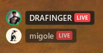
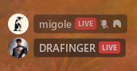
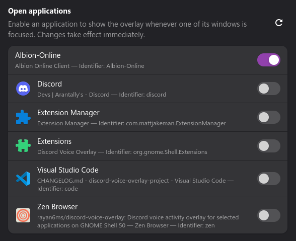
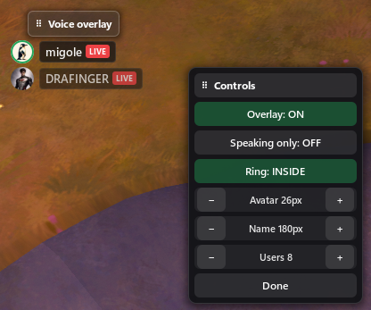

# Discord Voice Overlay for GNOME

See who is speaking in your Discord voice channel without leaving your game. The overlay shows avatars, names, speaking activity, mute/deafen status, and live streams over applications you choose.




## Requirements

- GNOME Shell **50** on Wayland
- Discord Desktop for Linux (Snap is not supported by Vencord)
- `gnome-extensions`, `curl`, `git`, `unzip`, `node`, and `pnpm`

You do not need to clone or build this repository.

The Git, Node.js, and pnpm requirements come from [Vencord's custom-plugin system](https://docs.vencord.dev/installing/custom-plugins/), which requires a Vencord source build. The installer below handles that build for you. Vencord's ordinary one-line installer cannot load this project's custom bridge by itself.

[Vencord](https://vencord.dev/) is a third-party Discord client modification. Client modifications are against Discord's Terms of Service, so decide whether that trade-off is acceptable before installing.

## Install

Close Discord, then run:

```sh
sh -c "$(curl -fsSL https://github.com/rayan6ms/discord-voice-overlay/releases/download/v1.0.1/install.sh)"
```

The script:

1. Downloads and verifies the v1.0.1 release packages.
2. Downloads or updates the Vencord source needed for custom plugins.
3. Adds DiscordVoiceOverlay, builds Vencord, and opens Vencord's installer.
4. Installs the GNOME extension last, so the required logout is your final installation step.

When Vencord's installer opens, choose your Discord installation and select **Install**. Then:

1. Fully restart Discord.
2. Open **Discord Settings → Vencord → Plugins**, enable **DiscordVoiceOverlay**, and restart Discord again if prompted.
3. Log out of GNOME and log back in.
4. Enable the extension and open its preferences:

```sh
gnome-extensions enable discord-voice-overlay@rayan6ms.github.io
gnome-extensions prefs discord-voice-overlay@rayan6ms.github.io
```

In **Open applications**, switch on each application where the overlay should appear. An application must be running for the picker to show it.



The default allowlist is empty, so the overlay stays hidden until you select an application.

### Existing Vencord source checkout

The installer uses `$HOME/.local/src/Vencord` by default. If your source checkout is elsewhere:

```sh
VENCORD_DIR="/path/to/Vencord" \
    sh -c "$(curl -fsSL https://github.com/rayan6ms/discord-voice-overlay/releases/download/v1.0.1/install.sh)"
```

### Manual installation

If you prefer to inspect and run every step yourself:

1. Follow Vencord's official [source installation](https://docs.vencord.dev/installing/) guide.
2. Download `discord-voice-overlay-vencord-plugin-v1.0.1.zip` from the [v1.0.1 release](https://github.com/rayan6ms/discord-voice-overlay/releases/tag/v1.0.1).
3. Extract its `discordVoiceOverlay` folder into `Vencord/src/userplugins/`.
4. Run `pnpm build` and `pnpm inject` inside the Vencord checkout, then restart Discord and enable **DiscordVoiceOverlay**.
5. Download `discord-voice-overlay-gnome-v1.0.1.zip` from the same release and install it last:

```sh
gnome-extensions install --force ./discord-voice-overlay-gnome-v1.0.1.zip
```

Log out and back in, enable the extension, and select your applications as described above.

## Use the overlay

The default edit-mode shortcut is **Ctrl+,**. Press it while an allowed application is focused to show the controls.



- **Overlay** shows or hides the voice list.
- **Speaking only** hides people who are not currently speaking.
- **Ring** moves the speaking ring inside or outside the avatar.
- **Avatar**, **Name**, and **Users** adjust the layout.
- Drag **Voice overlay** and **Controls** independently.
- Select **Done** or press **Ctrl+,** again when finished.

You can change or disable the shortcut in extension preferences.

## Update

Run the installer command for the new release. It backs up only the existing `discordVoiceOverlay` plugin folder, rebuilds Vencord, and replaces the GNOME extension. Restart Discord and log out/in to load the new code.

## Troubleshooting

### The overlay does not appear

Check that:

- Discord is connected to a voice channel.
- **DiscordVoiceOverlay** is enabled in Vencord.
- The focused application is enabled in extension preferences.
- The GNOME extension is enabled:

```sh
gnome-extensions info discord-voice-overlay@rayan6ms.github.io
```

### The application list is empty

The extension must be enabled, and the application you want must be open. Select the refresh button in **Open applications** after opening it.

### The old version is still running

GNOME Shell caches extension code. Log out through GNOME's system menu and log back in. Do not kill the live GNOME Shell process.

### Vencord fails to build

From the Vencord source directory, run:

```sh
git pull --ff-only
pnpm install --frozen-lockfile
pnpm build
pnpm inject
```

Use pnpm, not npm or yarn. Vencord does not support third-party custom plugins, so report project-specific problems in this repository.

### Fullscreen problems

Try windowed fullscreen and inspect extension errors:

```sh
journalctl --user -b -o cat | grep -F DiscordVoiceOverlay
```

Fullscreen composition can vary by application, graphics driver, and display server.

## Uninstall

Disable and remove the GNOME extension:

```sh
gnome-extensions disable discord-voice-overlay@rayan6ms.github.io
rm -rf "$HOME/.local/share/gnome-shell/extensions/discord-voice-overlay@rayan6ms.github.io"
```

Remove the bridge from your Vencord source checkout, rebuild, and apply Vencord again:

```sh
VENCORD_DIR="$HOME/.local/src/Vencord"
rm -rf "$VENCORD_DIR/src/userplugins/discordVoiceOverlay"
cd "$VENCORD_DIR"
pnpm build
pnpm inject
```

Fully restart Discord afterward.

## Privacy

DiscordVoiceOverlay writes voice-channel display data to `$XDG_RUNTIME_DIR/discord-voice-overlay/state.json`, readable only by your Linux user. The project has no server, telemetry, analytics, or update checker. GNOME Shell requests avatar images directly from Discord's CDN.

The local state includes user IDs, display names, voice status, and avatar URLs. It is removed when the plugin stops cleanly and ignored by the extension if Discord exits without cleaning it up.

Report suspected vulnerabilities privately through [GitHub Security Advisories](https://github.com/rayan6ms/discord-voice-overlay/security/advisories/new). Remove private usernames, channel names, and window titles from public bug reports.

## Development

Developer setup, checks, and packaging instructions are in [CONTRIBUTING.md](CONTRIBUTING.md). Release history is in [CHANGELOG.md](CHANGELOG.md).

## Licence

This project is licensed under `GPL-3.0-or-later`. See [LICENSE](LICENSE).
