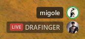

# Discord Voice Overlay for GNOME

See who is speaking in your Discord voice channel without leaving your game. The overlay shows avatars, names, speaking activity, mute/deafen status, and streaming status over applications you choose.




## Requirements

- GNOME Shell **50** on Wayland
- Discord Desktop for Linux (Snap is not supported by Vencord)
- Node.js 22 or newer, with at least one of pnpm, Corepack, or npm
- `gnome-extensions`, `curl`, `git`, `unzip`, and `sha256sum`

The installer handles the [Vencord source build required for custom plugins](https://docs.vencord.dev/installing/custom-plugins/) and prepares pnpm automatically.

[Vencord](https://vencord.dev/) is a third-party Discord client modification. Client modifications are against Discord's Terms of Service, so decide whether that trade-off is acceptable before installing.

## Install or update

Close Discord, then run:

```sh
sh -c "$(curl -fsSL https://github.com/rayan6ms/discord-voice-overlay/releases/latest/download/install.sh)"
```

Use this same command for the first installation and every future update. The `latest` URL always selects the current stable release. The script:

1. Downloads and verifies the latest release packages.
2. Downloads or updates the Vencord source needed for custom plugins.
3. Safely replaces the existing bridge, builds Vencord, and opens Vencord's installer.
4. Installs or replaces the GNOME extension last.
5. Disables and backs up the old prerelease `discord-voice-overlay@local` extension when present.

When Vencord's installer opens, choose your Discord installation and select **Install**. Then:

1. Fully restart Discord.
2. Open **Discord Settings → Vencord → Plugins**, enable **DiscordVoiceOverlay**, and restart Discord again if prompted.
3. Log out of GNOME and log back in.
4. Enable the extension and open its preferences:

```sh
gnome-extensions enable discord-voice-overlay@rayan6ms.github.io
gnome-extensions prefs discord-voice-overlay@rayan6ms.github.io
```

In **Open applications**, switch on each application where the overlay should appear. An application must be running for the picker to show it.


The default allowlist is empty, so the overlay stays hidden until you select an application.

### Existing Vencord source checkout

The installer uses `$HOME/.local/src/Vencord` by default. If your source checkout is elsewhere:

```sh
VENCORD_DIR="/path/to/Vencord" \
    sh -c "$(curl -fsSL https://github.com/rayan6ms/discord-voice-overlay/releases/latest/download/install.sh)"
```

## Use the overlay

The default edit-mode shortcut is **Ctrl+,**. Press it while an allowed application is focused to show the controls.


- **Overlay** shows or hides the voice list.
- **Speaking only** hides people who are not currently speaking.
- **Ring** moves the speaking ring inside or outside the avatar.
- **Avatar**, **Name**, and **Users** adjust the layout.
- Drag **Voice overlay** and **Controls** independently.
- Select **Done** or press **Ctrl+,** again when finished.
- Press **Ctrl+Z** to undo and **Ctrl+Y** to redo.
- Press **Esc** to leave edit mode and discard that edit session.

You can change or disable the shortcut in extension preferences.

## Troubleshooting

### The overlay does not appear

Check that:

- Discord is connected to a voice channel.
- **DiscordVoiceOverlay** is enabled in Vencord.
- The focused application is enabled in extension preferences.
- The GNOME extension is enabled:

```sh
gnome-extensions info discord-voice-overlay@rayan6ms.github.io
```

### Fullscreen problems

Try windowed fullscreen and inspect extension errors:

```sh
journalctl --user -b -o cat | grep -F DiscordVoiceOverlay
```

Fullscreen composition can vary by application, graphics driver, and display server.

## Uninstall

Disable and remove the GNOME extension:

```sh
gnome-extensions disable discord-voice-overlay@rayan6ms.github.io
rm -rf "$HOME/.local/share/gnome-shell/extensions/discord-voice-overlay@rayan6ms.github.io"
```

Close Discord, remove the bridge, then reinstall regular Vencord:

```sh
VENCORD_DIR="$HOME/.local/src/Vencord"
rm -rf "$VENCORD_DIR/src/userplugins/discordVoiceOverlay"
sh -c "$(curl -sS https://vencord.dev/install.sh)"
```

Fully restart Discord afterward.

## Privacy

DiscordVoiceOverlay writes voice-channel display data to `$XDG_RUNTIME_DIR/discord-voice-overlay/state.json`, readable only by your Linux user. The project has no server, telemetry, analytics, or update checker. GNOME Shell requests custom avatar images directly from Discord's CDN; default avatars use a local icon.

The local state includes user IDs, display names, voice status, and avatar URLs. It is removed when the plugin stops cleanly. If Discord exits without removing it, the extension discards it after 45 seconds.

## License

This project is licensed under `GPL-3.0-or-later`. See [LICENSE](LICENSE).
